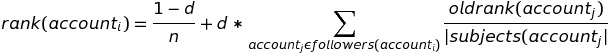

# CS 5513 PageRank (Spring 2016)
Implement basic page rank algorithm in Pig Latin

A database contains three tables, twitter_account, follows_account and stack_overflow_account, with the following schemas: 
 
* 
      twitter_account(
          twitter_account_id: int, 
          email_address: string,
          phone_number: string, 
          user_location: string,
          num_tweets: int)

* 
      follows_account(
          follower_twitter_account_id: int,
          subject_twitter_account_id: int)

* 
      stack_overflow_account(
          email_address: string,
          reputation: int,
          num_questions: int)
 
Every twitter account has a unique twitter_account_id and a unique email_address. The data for the three tables are contained in the files HW4-twitter_account.csv, HW4-follows_account.csv, and HW4-stack_overflow_account.csv, respectively, posted on the class website. Using Apache Pig, perform the following tasks: 
 
## Task Specifications

1) For each of the following queries (1a-1c), script in pig named `query_<letter>.pig` implements:

    a. Given a positive three-digit integer k that represents the phone area code _read as a user input to the query_, the email addresses associated with the twitter accounts that have a phone number starting with that area code k. The output of this query has the format: 
    
        (k, {email_address1, email_address2,…}) 

    b. For every `user\_location`, the number of twitter accounts that have that `user\_location` value. The output of this query has the format:
    
        (‘Houston’, 12)
        (‘Oklahoma City’, 34) 

    c. Given a positive integer _k read as a user input to the query_, average reputation of stack_overflow accounts associated with the twitter accounts of people who have published more than k tweets. The output of this query has the format:
    
        (num_tweets, avg_stack_overflow_reputation) 
 
2) Implement a single iteration of the PageRank algorithm to rank twitter accounts where a twitter account X is treated as a webpage X, a twitter account Y that X follows is treated as X’s forward webpage (link), and a twitter account Z that follows X is treated as X’s backward webpage (link). The rank of a twitter account is thus the same as the PageRank of a webpage in the PageRank algorithm. Script in Pig named `twitter_account_rank_iteration.pig` first reads a file `HW4-old_twitter_account_ranks.csv`. Each line in this file contains the initial twitter_account rank (i.e. PageRank) for a twitter account in the following format:

        (twitter_account_id, twitter_account_rank)
      
      Then, Pig script will compute the new rank for every twitter_account using the following PageRank formula:
      
      
      
    where d is the damping factor with the value of 0.85, n is the total number of twitter_accounts, _followers(account~i~)_ is the set of twitter accounts that follow _account~i~_ and _|subjects(account~j~)|_ is the number of twitter accounts that  accountj follows. Then, program then stores these computed ranks back into the file `HW4old_twitter_account_ranks.csv`, overwriting the previous ranks. 

3) Implement a program that will allow you to run multiple iterations of the PageRank algorithm. `driver.py` runs the Pig script written in Task 2 (`twitter_account_rank_iteration.pig`) for a particular number _m_ of iterations read as a user input to the program.

4) Implement a Pig script named `find_ninety_nine_percentile_accounts.pig` to find the twitter_account_ids, email_addresses and twitter_account_ranks of the_ k-percentile_ twitter accounts based on their twitter_account_ranks where k is a user input to the query.  The output of this query must be in the format:
        
        {(twitter_account_id1, email_address1, twitter_account_rank1), (twitter_account_id2, email_address2, twitter_account_rank2),…} 
